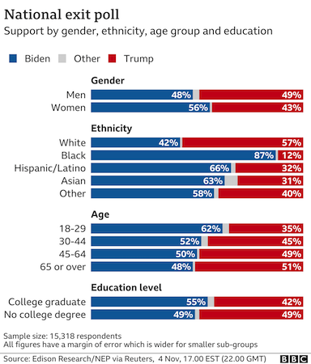
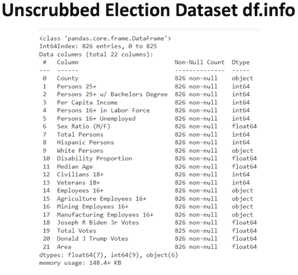
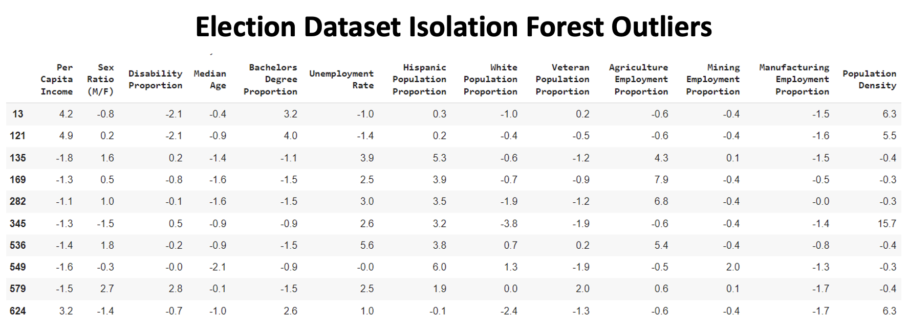
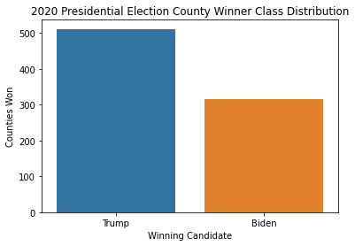
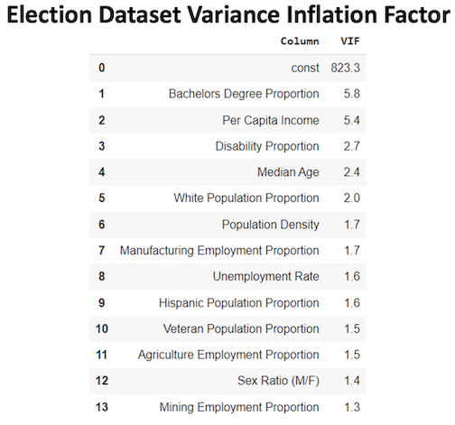
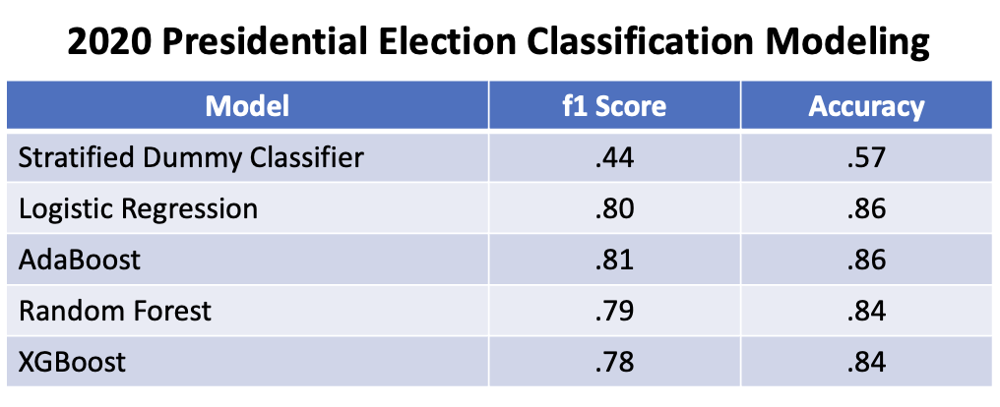
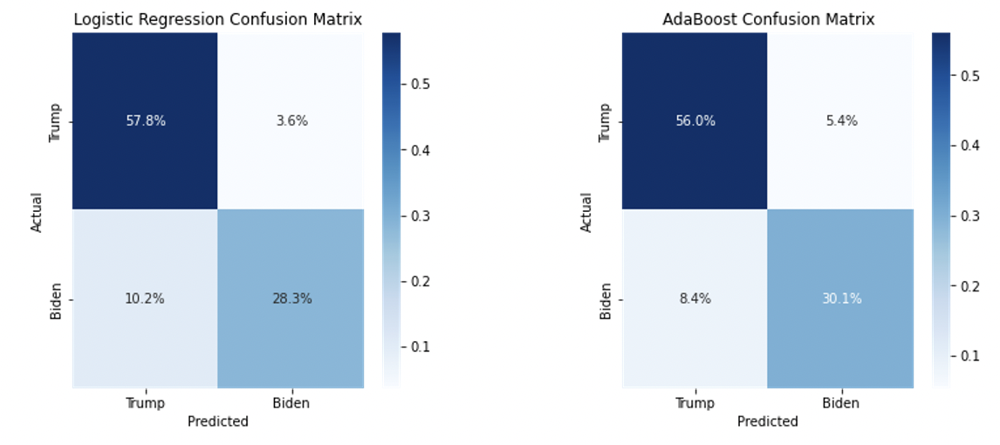
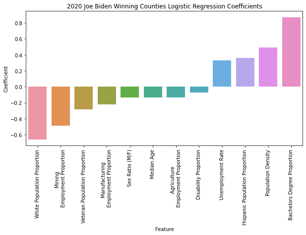
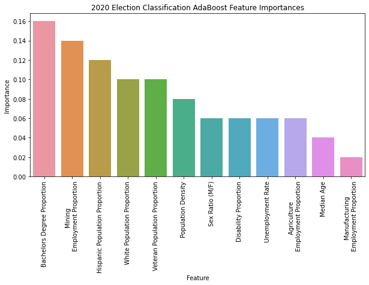

# 2020 Presidential Election County Level Classification Modeling

## Introduction
Coming out of presidential elections, exit polls give a survey based overview of the relative support for competing candidates among different demographic groups. But these polls are siloed between the different questions and don't provide a holistic view of how people's various demographic characteristics interact to drive support for a candidate. I sought to improve upon exit polls by building a model that would classify whether a county voted for Joe Biden in the 2020 presidential election based upon the demographic features of that county. The objective was to gather business intelligence about how demographic features interacted to drive support for Joe Biden using the Logistic Regression feature coefficients.

I obtained csv files with county level demographic features from the US Census Bureau and county level election results from Harvard Dataverse. After merger and scrubbing, there were 826 county level datapoints with 12 features. Logistic Regression strongly outperformed the baseline Dummy Regressor (Test f1 score: .80 vs. .44). The features most positively influencing support for Joe Biden were Bachelor's Degree Proportion (Coefficient: .87) and Population Density (Coefficient: .49). The features most negatively influencing support for Joe Biden were White Population Proportion (-.66) and Mining Employment Proportion (-.49). Overall, the top performing election classification model was AdaBoost (Test f1 score: .81). AdaBoost had top feature importances of Bachelor's Degree Proportion (Importance: .16) and Mining Employment Proportion (Importance: .14).

## Obtain Data
I obtained county level demographic data in csv form from the US Census Bureau website. I selected the demographic features to use for modeling based upon exit polls and other information about characteristics driving support for Joe Biden in the 2020 US presidential election. I downloaded the county level 2020 presidential election results in csv form from the Harvard Dataverse website. After reading the data into Pandas and scrubbing the county names to match across the csv files, I merged the datasets together. This resulted in 22 pre-scrubbing variables across 826 datapoints.

## Scrub Data

Many variables in the dataset were feature population counts heavily correlated with the overall population of each county. In order to make these features values comparable across counties of different sizes, I divided them by their county populations to turn them into proportions (Ex: Bachelor's Degree Population / Total Population = Bachelor's Degree Proportion). I coded the dependent class variable, Winning Candidate, into Biden Counties and Trump counties based on the candidate that received the greater vote share in each county. I then dropped all features no longer useful for modeling after calculating these interactions.

In order to deal with missing data, I first filled in two missing feature values using manually researched numbers. I imputed the remaining missing datapoints with KNN Imputer. This avoided having dropped datapoints reduce the sample size, while replacing missing values with the most accurate numbers possible. I next used Isolation Forest to identify the greatest outliers in the dataset. I didn't find any incorrectly entered or anomalous datapoints that needed to be dropped. However, I decided to replace all dataset values greater than 5 standard deviations from the mean with the 5 standard deviation value. This would mitigate the normal decrease in model performance caused by a feature values far from the mean.

## Explore Data

The 2020 presidential election dataset was moderately class imbalanced with 315 Biden class datapoints (38% of total) and 511 Trump class datapoints (62% of total). I decided not to re-balance the dataset as it was close enough to class balanced to allow for effective modeling and I was unsure about the impact of rebalancing on model performance. I instead used f1 score as the principal evaluation metric to ensure that the modeling process would prioritize being effective at predicting both classes.

I used Variance Inflation Factor to find correlated features that would skew the Logistic Regression feature coefficients. I dropped Per Capita Income as its .82 correlation with Bachelor's Degree Proportion was the primary driver of both features' VIF scores above 5. After dropping this feature, Bachelor's Degree Proportion had the highest VIF score at only 2.7, meaning no excessive correlation remained in the dataset.

## Model Data

I built 4 classification models, all of which significantly outperformed the baseline Stratified Dummy Classifier (Test f1 score: .44). The top performing model with feature coefficients was l2 Logistic Regression (Test f1 score: .80). The top performing overall model was Adaboost (Test f1 score: .81), which also provided access to feature importances. Logistic Regression and AdaBoost had equal test set accuracy scores (Test accuracy: .86).

The confusion matrices confirmed strong modeling results for the 2020 county level presidential election results dataset. Logistic Regression had an accuracy of .85 on predicted Trump counties and .89 on predicted Biden counties. Similarly, AdaBoost scored a .87 accuracy on Trump class predictions and .85 on Biden class predictions. The consistent modeling results across both classes confirmed that strong performance was possible without the need for resampling to balanced classes.

## Analyze Results

Logistic Regression modeling produced four positive coefficients predicting county level support for Joe Biden (Bachelor's Degree Proportion, Population Density, Hispanic Population Proportion and Unemployment Rate). There were an additional four features that did not strongly predict support for Joe Biden (Sex Ratio (M/F), Median Age, Agricultural Employment Proportion and Disability Proportion). Finally, four features negatively influenced support for Joe Biden (White Population Proportion, Mining Employment Proportion, Veteran Population Proportion and Manufacturing Employment Proportion). Overall, the strongest coefficients influencing county level support for Joe Biden were Bachelor's Degree Proportion (.87), White Population Proportion (-.66), Population Density (.49) and Mining Employment Proportion (-.49).

AdaBoost feature importances were largely consistent with the coefficients from Logistic Regression. The two most importance features, Bachelor's Degree Proportion (.16) and Mining Employment Proportion (.14), were among the four most influential coefficients in Logistic Regression. On the other hand, the two least important features in AdaBoost, Manufacturing Employment Proportion (.02) and Median Age (.04), were among Logistic Regression's five least influential coefficients.

## Conclusion

I set out to build a model that would provide a holistic view of how demographic features interacted to drive county level support for Joe Biden in the 2020 presidential election. This would improve upon traditional exit polling, which provides a siloed view of how individual demographic features relate to political support but not how they relate to one another.

Many of the demographic features included in post election exit polls influenced support for Joe Biden in the 2020 presidential election according to Logistic Regression feature coefficients. Bachelor's Degree Proportion was the strongest driver of support for Joe Biden. This feature was highly correlated with Per Capita Income meaning that income also strongly influenced support for Joe Biden. While an educated  workforce positively correlated with support for Biden, manual labor workers in mining and manufacturing negatively influenced support for him. Ruralness also negatively influenced support for Joe Biden. 

Ethnicity played a large role in driving Biden support as hispanic and non-white voters positively influenced Biden's probability of winning a county. Other features correlated with support for Joe Biden in exit polls didn't show a strong relationship with Biden support in regression coefficients. These included age, sex, agricultural employment and disabled population. This was likely due to these features being correlated with other features that did influence support for Biden but not themselves greatly affecting support. 

Logistic Regression modeling of county level results in the 2020 presidential election was able to provide a more holistic understanding of the features that drove support for Joe Biden when compared to exit polls. Going forward, I would like to improve upon modeling by including additional demographic features from census data.

# Github Files
[2020_Pres_Election_Modeling.ipynb](https://github.com/blantj/2020_pres_election_classification/blob/main/2020_Pres_Election_Modeling.ipynb) :  2020 US Presidential Election Classification Modeling

# Sources
US Census: https://data.census.gov/cedsci/

Harvard Dataverse: https://dataverse.harvard.edu/dataset.xhtml?persistentId=doi:10.7910/DVN/VOQCHQ
